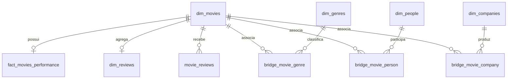

# Modelo de dados da camada Gold

Os números abaixo descrevem esse arquivo e devem ser atualizados se a base mudar.
O banco foi aberto em modo somente leitura; nenhuma chamada ao modelo foi necessária.

## Fontes e reprodução

- [schema.sql](schema.sql): DDL das tabelas, restrições e índices extraído do banco.
- [database-profile.json](database-profile.json): colunas, tipos, chaves, índices,
  contagens e resultados das verificações.
- [business-rules.md](business-rules.md): decisões de interpretação para o agente.

Com o ambiente preparado, execute na raiz:

```bash
python scripts/profile_database.py --reference-date 2026-10-04
```

Sem `--reference-date`, o script usa a data atual de São Paulo. Ele atualiza somente
os dois arquivos de evidências em `docs/`. Não exporta nomes ou textos de avaliações.
O JSON registra as restrições declaradas; a descrição abaixo distingue essas
restrições dos padrões observados nos dados.

## Tabelas, granularidade e volume

| Tabela | Uma linha representa | Chave primária | Linhas |
| --- | --- | --- | ---: |
| `dim_movies` | Um filme | `sk_movie_id` | 95.645 |
| `fact_movies_performance` | Métricas de um filme | `sk_movie_id` | 95.645 |
| `dim_genres` | Um gênero | `sk_genre_id` | 19 |
| `dim_people` | Um nome associado a um papel | `sk_person_id` | 424.656 |
| `dim_companies` | Uma produtora | `sk_company_id` | 45.941 |
| `bridge_movie_genre` | Uma associação filme–gênero | `(sk_movie_id, sk_genre_id)` | 121.521 |
| `bridge_movie_person` | Uma associação filme–pessoa/papel | `(sk_movie_id, sk_person_id)` | 745.450 |
| `bridge_movie_company` | Uma associação filme–produtora | `(sk_movie_id, sk_company_id)` | 116.326 |
| `dim_reviews` | Agregado das avaliações locais de um filme | `sk_review_id` | 40.267 |
| `movie_reviews` | Uma avaliação individual local | `id` | 43.666 |
| `alembic_version` | Versão de migração | `version_num` | 1 |

`alembic_version` é uma tabela técnica e deve ficar fora do contexto de consultas
analíticas do agente. Apesar do nome `dim_reviews`, seu conteúdo é um agregado por
filme, e não uma dimensão de avaliações individuais.

## Relacionamentos



As cardinalidades acima refletem as restrições: no máximo um desempenho e um agregado
por filme; zero ou mais avaliações e associações. Neste arquivo, todos os filmes têm
desempenho. `PRAGMA foreign_key_check` não encontrou referências inválidas.

Use sempre as chaves `sk_*` nos joins, não títulos ou nomes. As chaves são textos de
até 64 caracteres. `id_filme` é um identificador de origem com índice único, sem
indicação no banco de qual sistema o produziu.

## Dicionário de colunas

### `dim_movies`

| Coluna | Tipo declarado | Significado e observações |
| --- | --- | --- |
| `sk_movie_id` | VARCHAR(64) | Chave do filme, obrigatória |
| `id_filme` | VARCHAR(50) | Identificador de origem obrigatório e único |
| `titulo` | VARCHAR(500) | Título obrigatório; não é uma chave única |
| `data_lancamento` | DATE | Data de lançamento; armazenada em formato interpretável pelo SQLite |
| `ano_lancamento` | INTEGER | Ano para agrupamentos |
| `duracao_minutos` | INTEGER | Duração em minutos |
| `idioma_original` | VARCHAR(10) | Código do idioma |
| `status_filme` | VARCHAR(50) | Estado de produção/lançamento |
| `sinopse` | VARCHAR(4000) | Texto descritivo |
| `url_poster`, `url_backdrop` | VARCHAR(2048) | Endereços das imagens |

Somente as três primeiras colunas são declaradas obrigatórias. Datas e anos estão
preenchidos em todos os filmes inspecionados e são consistentes entre si. As datas
vão de 01/01/2016 a 13/10/2029; o catálogo não representa toda a história do cinema.

Status observados: `Lançado` (94.304), `Pós-Produção` (693), `Em Produção` (598) e
`Planejado` (50). Nenhum filme com status `Lançado` tem data posterior a 04/10/2026.

### `fact_movies_performance`

| Coluna | Tipo declarado | Significado |
| --- | --- | --- |
| `sk_movie_id` | VARCHAR(64) | PK e FK para `dim_movies`, obrigatória |
| `orcamento_usd`, `receita_usd` | NUMERIC(18,2) | Orçamento e receita em dólares; podem ser nulos |
| `lucro_usd` | NUMERIC(18,2) | Lucro armazenado em dólares, obrigatório |
| `orcamento_brl`, `receita_brl` | NUMERIC(18,2) | Orçamento e receita em reais; podem ser nulos |
| `lucro_brl` | NUMERIC(18,2) | Lucro armazenado em reais, obrigatório |
| `popularidade` | DOUBLE | Indicador de popularidade; fórmula não informada |
| `nota_tmdb`, `nota_imdb` | DOUBLE | Notas das plataformas |
| `qtd_tmdb`, `qtd_imdb` | INTEGER | Quantidades de votos nas respectivas plataformas |

Não há coluna de margem, ROI ou data de atualização das métricas. O arquivo é um
snapshot: consultar o SQLite não atualiza notas ou bilheterias nas plataformas.

### Dimensões e pontes

| Tabela | Colunas além das chaves | Restrições e interpretação |
| --- | --- | --- |
| `dim_genres` | `nome_genero VARCHAR(50)` | Nome obrigatório e único, em inglês |
| `dim_companies` | `nome_produtora VARCHAR(255)` | Nome obrigatório e único |
| `dim_people` | `nome_pessoa VARCHAR(255)`, `tipo_pessoa VARCHAR(20)` | Ambos obrigatórios; par nome/papel único; papel limitado a `Ator`, `Diretor`, `Roteirista` |
| `bridge_movie_genre` | Nenhuma | Duas FKs obrigatórias; par único |
| `bridge_movie_person` | Nenhuma | Duas FKs obrigatórias; par único |
| `bridge_movie_company` | Nenhuma | Duas FKs obrigatórias; par único |

O papel da pessoa está em `dim_people.tipo_pessoa`, não na ponte. Há 273.400 registros
de atores, 65.200 de diretores e 86.056 de roteiristas. Existem 48.210 nomes associados
a mais de um papel. A mesma pessoa pode ter chaves diferentes para papéis diferentes.
O modelo também pode reunir homônimos com o mesmo papel: não há identificador externo
para desambiguá-los. Resultados sobre pessoas refletem essa limitação.

### Avaliações de usuários

| Tabela | Coluna | Tipo e significado |
| --- | --- | --- |
| `dim_reviews` | `sk_review_id` | VARCHAR(64), PK do agregado |
| `dim_reviews` | `sk_movie_id` | VARCHAR(64), FK obrigatória e única por filme |
| `dim_reviews` | `qtd_avaliacoes_usuarios` | INTEGER obrigatório, quantidade local |
| `dim_reviews` | `nota_media_usuarios` | DOUBLE, média local |
| `movie_reviews` | `id` | INTEGER, PK da avaliação individual |
| `movie_reviews` | `sk_movie_review_id` | VARCHAR(64), obrigatório e com índice único |
| `movie_reviews` | `sk_movie_id` | VARCHAR(64), FK obrigatória |
| `movie_reviews` | `name` | VARCHAR(120), nome informado pelo avaliador |
| `movie_reviews` | `rating` | DOUBLE obrigatório, restrição de 0 a 10 |
| `movie_reviews` | `text` | VARCHAR(4000), texto obrigatório |
| `movie_reviews` | `created_at` | DATETIME obrigatório, padrão CURRENT_TIMESTAMP |

Os 40.267 filmes com avaliações individuais têm agregados correspondentes, sem
divergências de contagem ou médias acima de 0,01 ponto. As quantidades por filme vão
de 1 a 13. Use `dim_reviews` nas análises agregadas; use `movie_reviews` para recortes
por data ou texto. Não trate `name` como identificador único de usuário.

## Cobertura e qualidade que afetam as respostas

| Achado | Consequência |
| --- | --- |
| 92.272 receitas e 87.719 orçamentos em BRL são nulos | Dados ausentes não devem virar zero nas respostas |
| Somente 1.630 filmes têm receita e orçamento positivos | Margens e lucros com dados completos usam uma amostra pequena |
| 1.743 filmes têm receita, mas não orçamento | O lucro armazenado desses filmes não demonstra lucro com custo conhecido |
| 85.976 filmes não têm receita nem orçamento | Lucro obrigatório não significa finanças informadas |
| Nenhum orçamento/receita BRL é zero ou negativo neste arquivo | Filtros `IS NOT NULL` e `> 0` coincidem aqui, mas têm significados diferentes |
| Lucro USD coincide com receita menos orçamento, substituindo ausentes por zero | Não confiar na existência de `lucro_*` para inferir dados completos |
| Diferença máxima no lucro BRL recalculado é aproximadamente R$ 0,01 | Compatível com arredondamento; evitar igualdade exata de floats |
| Razão receita BRL/USD varia de aproximadamente 3,0504 a 5,8391 | Usar os valores convertidos do banco; não aplicar câmbio atual ou uma taxa única |
| 12.674 notas IMDb são nulas, inclusive 8.354 com votos positivos | Contagem de votos não substitui a validação da nota |
| 36.185 notas TMDB são zero; 142 têm votos positivos | Zero com votos não pode ser descartado automaticamente como ausência |
| 3.615 popularidades são nulas | Excluir ausência de rankings de popularidade |
| 20.037 filmes sem gênero, 36.179 sem produtora, 1.125 sem pessoas | Joins internos nessas dimensões reduzem o universo de filmes |

Os dois últimos achados financeiros descrevem os dados; a origem da conversão e sua
metodologia não estão documentadas no arquivo.

## Índices e cuidado com joins

Há índices de título, identificador e ano em filmes; nome em pessoas; pessoa na ponte
de elenco/equipe; filme nas avaliações individuais; e índices únicos das PKs e
restrições de unicidade. As pontes têm PK composta iniciada por `sk_movie_id`.

As pontes representam relações muitos-para-muitos. Juntar gêneros, pessoas,
produtoras e avaliações individuais numa única consulta pode multiplicar linhas e
inflar receitas, lucros e contagens. Filtre com `EXISTS` quando só precisar verificar
uma associação; agregue cada relação antes de combinar métricas. `SUM(DISTINCT
receita_brl)` não corrige isso: filmes diferentes podem ter a mesma receita.

Em resultados agrupados por gênero ou produtora, um filme pode aparecer em mais de
um grupo. Isso é esperado e deve ser explicado; a soma entre grupos não representa
necessariamente o total único do catálogo.
